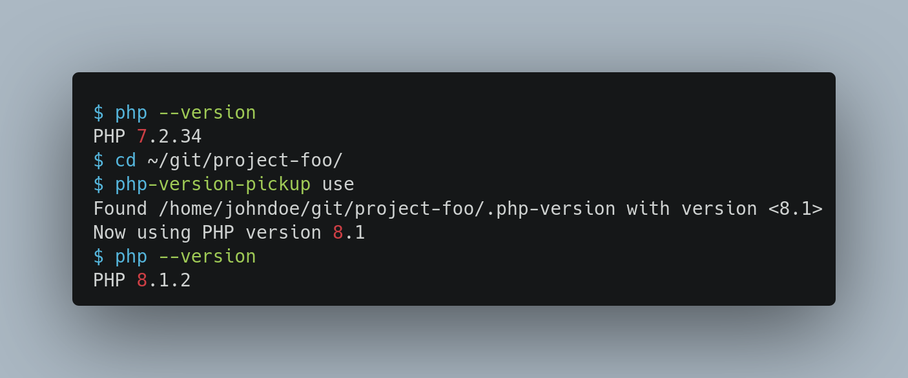

# PHP Version Pickup

Set a PHP version used in a shell session through a `.php-version` file.

[](https://packagist.org/packages/webit-de/php-version-pickup/)
[](https://gitlab.com/webit-de/php-version-pickup#requirements)
[](https://spdx.org/licenses/GPL-2.0-or-later.html)



## Vision

This tool is a small shell script to set the version of PHP
used in a shell session, by reading the expected version number
from a `.php-version` file.

This allows to handle multiple PHP versions in a local development environment
and switch the version between projects on the fly.
By pinning the version in a file it also allows team members to use same
PHP version when working on a project.

The script is inspired by [`nvm use`](https://github.com/nvm-sh/nvm#nvmrc) and
[`php-version`](https://github.com/wilmoore/php-version). The former is made for
Node and does a lot more (build & install versions etc.). The letter works
perfectly well with PHP, but does not want to store files nor support PHP
versions installed by the OS package manager.
That's why this script was created.

The file `.php-version` is already used by popular PHP packages like
[Symfony Server](https://symfony.com/doc/current/setup/symfony_server.html#selecting-a-different-php-version).

**Key Features**

- Set a PHP version for a shell session only (forget version in new shells,
  don't mangle system defaults)
- [Pass the version to subscripts as well](https://pixelbrackets.de/notes/pass-php-version-to-subscripts-in-cli-calls)
  (run Composer with the selected version, Composer passes the version to
  other executed PHP scripts as well)
- Pick up the version from a `.php-version` file
- Support PHP versions installed via PPA
- Written in Bash, to pick versions before running PHP scripts
- Does not attempt to manage version used by the OS or webserver (Apache, Nginx)

**Current limitations** *✨ Feel free to send a PR to resolve them✨*

- Mayor PHP version numbers only (`7.3`, `7.4`, no `7.3.10`)
- No `latest` version etc.
- No installation of missing versions
- No automatic execution (`cd` hook)
- No display of locally available versions
- No display of remote available versions (all PHP version releases)  
- Need to create version file manually (no `create` command yet)

## Requirements

- PHP (the script picks up existing PHP versions, it runs without PHP however
  as it is a shell script)

## Installation

- Clone the repository
  ```bash
  cd ~/
  git clone https://github.com/webit-de/php-version-pickup.git .php-version-pickup
  ```
- »Source« the script
  ```bash
  echo 'source $HOME/.php-version-pickup/bin/php-version-pickup.sh' >> $HOME/.bashrc
  ```
  *or* add the line manually to your `.bashrc` file
  ```bash
  source $HOME/.php-version-pickup/bin/php-version-pickup.sh # or your place of choice
  ```
- 🏗️ Install multiple PHP versions (build manually, use the great
  [PPA by Ondřej Surý](https://launchpad.net/~ondrej/+archive/ubuntu/php),
  or use a tool like [php-build](https://github.com/php-build/php-build) or
  [homebrew-php](https://github.com/josegonzalez/homebrew-php))
- Create symlinks pointing the PHP versions locally available

  This depends very much on the way you installed the multiple PHP versions.
  The general structure of each symlink is
  `$HOME/.php/versions/<version>/bin/php -> <path to version binary>`

  The following example assumes you installed three versions via Ondřejs PPA.
  *Adapt this to your own setup*.
  ```bash
  mkdir -p $HOME/.php/versions/7.3/bin && ln -s /usr/bin/php7.3 $HOME/.php/versions/7.3/bin/php
  mkdir -p $HOME/.php/versions/7.4/bin && ln -s /usr/bin/php7.4 $HOME/.php/versions/7.4/bin/php
  mkdir -p $HOME/.php/versions/8.0/bin && ln -s /usr/bin/php8.0 $HOME/.php/versions/8.0/bin/php
  ```
- 💡 You may want to add an alias as shortcut command to your `.bashrc` like
  `alias pvm="php-version-pickup"`

## Source

https://github.com/webit-de/php-version-pickup/

## Usage

The script reads the version from a file.

**Create a version file in your project of choice**

⚠ Right now only
[mayor PHP release numbers](https://www.php.net/supported-versions) are allowed,
which means something like `7.4` or `8.1` (not a specific version like `7.4.10`).

Example to set PHP version 7.4 in a project:
```bash
echo "7.4" > .php-version
```

**Pick up the version**

Run `php-version-pickup use` in your directory to pick up the version number.
You should see a message telling you that a file was found and which version
is used in your shell session from now on.

Run `php --version` to check the version.

Now you can run PHP scripts, Composer, whatever with the set version.

🥏 Play around with the version file, open and close shells, run some
PHP scripts and make yourself comfortable with this simple version picker.

**Provide feedback**

This script is a prototype and helped us in a very specific use case. Therefore,
some limitations exists (see [vision](#vision)). Feel free to send some
feedback or create a PR to enhance this script.

## License

GNU General Public License version 2 or later

The GNU General Public License can be found at http://www.gnu.org/copyleft/gpl.html.

## Author

Dan Untenzu (<untenzu@webit.de> / [@pixelbrackets](https://github.com/pixelbrackets))
for webit! Gesellschaft für neue Medien mbH (http://www.webit.de/)

## Changelog

See [CHANGELOG](./CHANGELOG.md)

## Contribution

> TYPO3 - inspiring people to share!

This package is Open Source, so please use, patch, extend or fork it.
